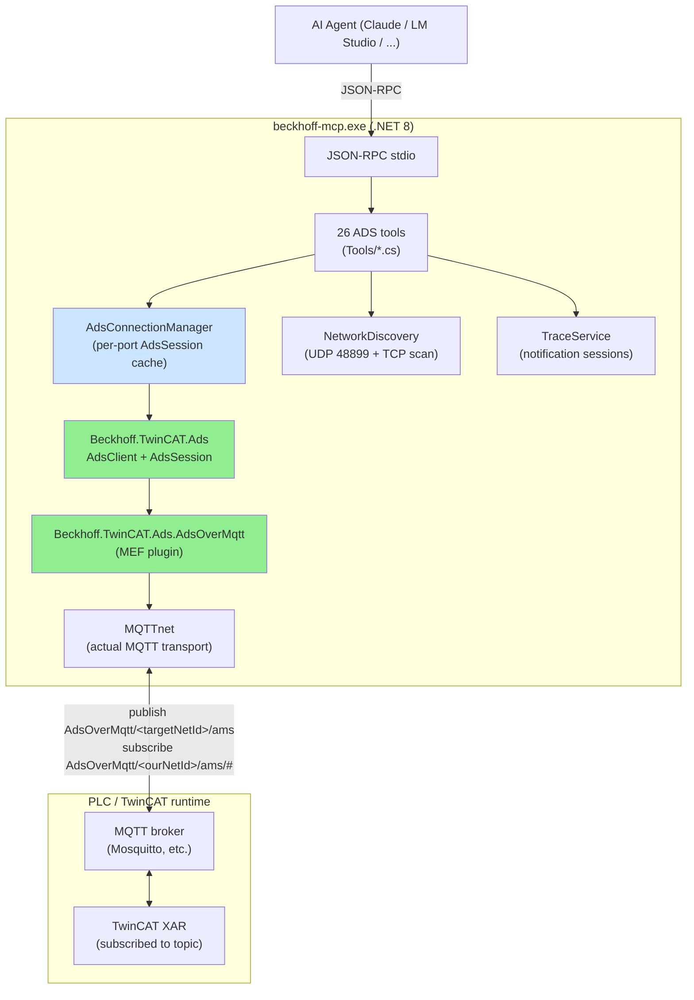
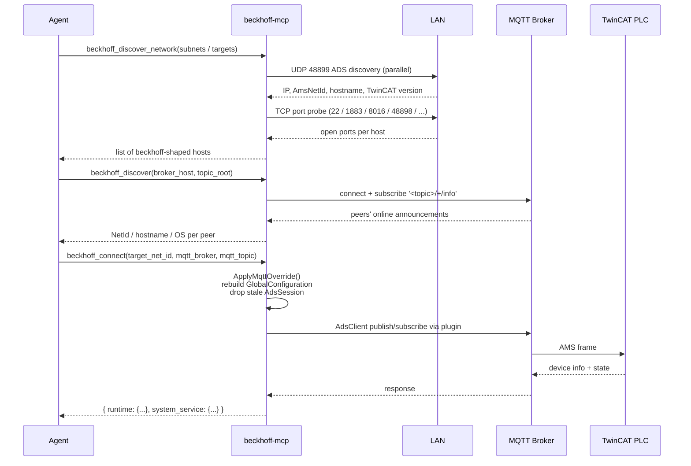
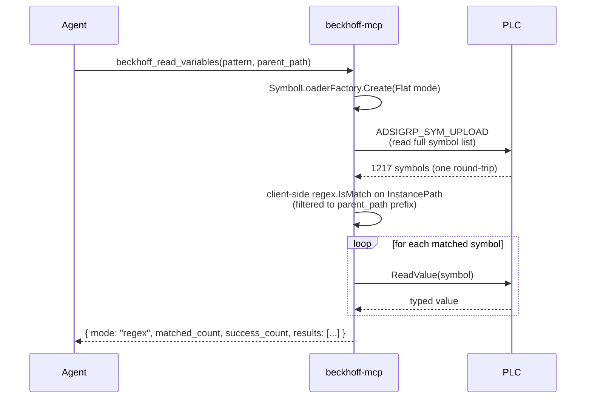

# Architecture

## Final stack

Green: the supported Beckhoff path that proves the whole system works without a
local TwinCAT install. Blue: our connection bookkeeping that makes broker /
target switching possible at runtime.

## Discovery and connect at runtime

`connect` always probes both the requested target port AND `SystemService` (10000),
so the agent gets a full picture of device-level vs application-level state in one
round-trip.

## Variable read with regex

ADS does **not** offer server-side regex symbol filtering — the entire symbol
table is uploaded once, then filtered locally. The sister-project `tcCLI`
implements this identically. We share the same `SymbolIterator` predicate
pattern from the official Beckhoff library.

## Why this architecture

The repo went through several iterations before landing here. The
`archive/experiments/` folder documents each stop on the way:

| Experiment | What it tried | Why it didn't ship |
|-----------|---------------|--------------------|
| `archive/python-mcp/` | Original pyads-based MCP | Needs `TcAdsDll.dll` + Win32 Window Message IPC to a local TwinCAT System Service. Won't run on a host without TwinCAT installed. |
| `archive/experiments/AdsRouter/` | Standalone .NET TCP-router (Beckhoff.TwinCAT.Ads.TcpRouter) | Connects to a broker and serves TCP-loopback for local clients, but doesn't forward arbitrary NetIds via MQTT. The MEF MQTT-plugin works at the local *Server* endpoint, not as a forwarding adapter. |
| `archive/experiments/AdsBridge/` | Custom TCP↔MQTT bridge in C# | Working proof — implements the AMS frame parser, routes by `<Type>` in StaticRoutes.xml. But Windows `pyads` still can't reach it (TcAdsDll bypasses TCP entirely), so the bridge only helps if you also rewrite the client. |
| `archive/experiments/AdsTestClient/` | Direct .NET AdsClient + AdsOverMqtt plugin | **Worked perfectly.** This is what the final MCP server uses internally — the plugin handles publish/subscribe on the broker, no router needed. The bridge became unnecessary. |

The key insight: **once the client code is .NET, the AdsOverMqtt plugin is the
shortest path** — it's the only Beckhoff-supported way of running an
ADS-over-MQTT-only stack without any local Beckhoff service. Rewriting the MCP
in C# (which we did) removed the need for everything in `archive/experiments/`.

## What couldn't be ported from the sister project

The sister project `Avm.Swiss.TwinCAT.CLI` has many tools that depend on
TwinCAT XAE (the engineering shell) via COM automation: `BuildTools`,
`ProjectTools`, `PouTools`, `LibraryTools`, `RuntimeTools`, `SafetyTools`,
`DialogTools`, `OutputPaneTools`, `SaveTools`, `TaskTools`, `TargetPlatformTools`,
`SessionTools`, `RouteTools`, `ComExplorerTools`. These are excluded by design
— they would re-introduce the XAE dependency we built this server to avoid.

What did get ported: every tool that talks to a running PLC over ADS
(read, write, RPC, type introspection, trace, EtherCAT diagnostics, route
discovery, connect with broker switch).

## Configuration semantics

| Source | Loads | Notes |
|--------|-------|-------|
| `appsettings.json` | Local fallback NetId, default target, MQTT broker config | Read at startup; persisted between runs |
| `connect()` overrides | `mqtt_broker`, `mqtt_port`, `mqtt_topic` | In-memory only; rebuilds `GlobalConfiguration` and drops the stale AdsSession atomically under one lock |
| Auto-generated | `AmsRouter:NetId` if missing | One random `10.x.y.z.1.1` per process |

`connect()` is the single entry point for changing target + broker at runtime.
It applies overrides, sets the intent target (so concurrent calls see the
new target immediately), then opens a fresh `AdsSession` — all under one lock.
