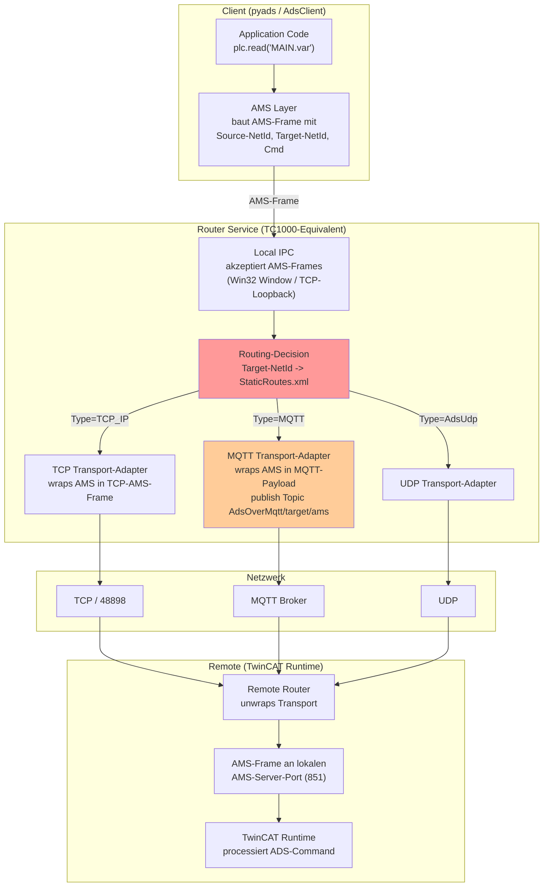
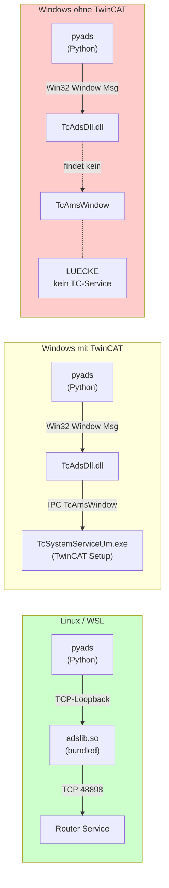
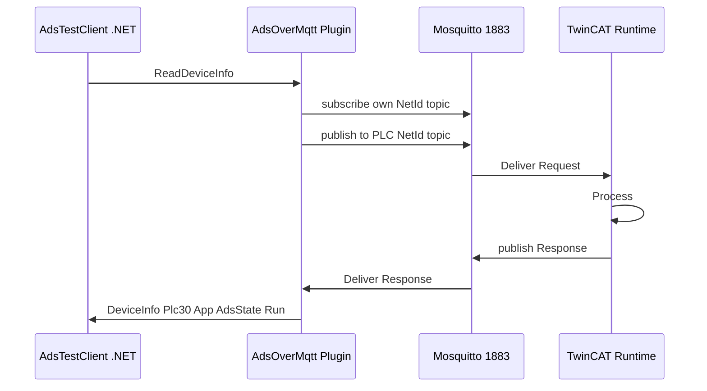
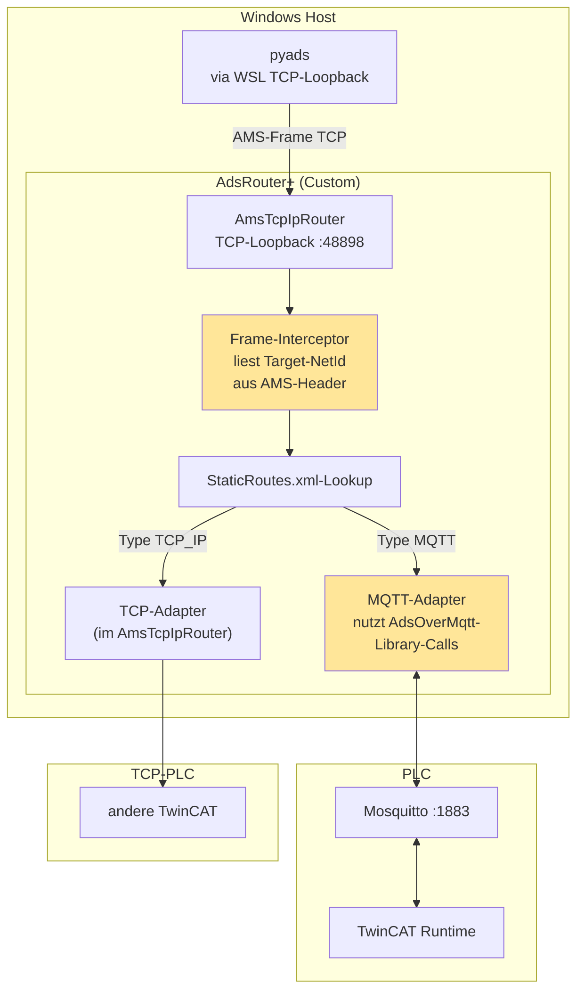

# AdsRouter Architektur

Ziel: TC1000-Funktionalitaet als eigene App. AMS-Schicht oben, Transport-Schicht unten, dazwischen die Routing-Engine.

## 1. Korrekte Schichten-Trennung



**Rot:** Routing-Decision liest Type-Feld aus Route-Eintrag und dispatcht.
**Orange:** MQTT-Transport-Adapter — das fehlende Stueck im NuGet-Stack.

## 2. Pyads-Schicht-Klaerung



Linux/WSL pyads spricht bereits TCP-AMS — kompatibel mit unserem Router. Windows-pyads ohne TwinCAT geht prinzipiell nicht (TcAdsDll braucht Win32-Window).

## 3. Was Beckhoff im NuGet-Stack tatsaechlich liefert

| Layer | Komponente | Rolle |
|-------|-----------|-------|
| AMS-Library | `Beckhoff.TwinCAT.Ads` (AdsClient) | baut AMS-Frames |
| Local IPC In | `AmsTcpIpRouter` TCP-Loopback | empfaengt AMS-Frames lokal |
| Routing | `AmsTcpIpRouter` interne Route-Engine | **nur TCP-Lookup** |
| Transport TCP | im AmsTcpIpRouter integriert | OK |
| Transport MQTT | `Beckhoff.TwinCAT.Ads.AdsOverMqtt` Plugin | **nur als Server-Endpoint, nicht als Forward-Adapter** |
| Transport UDP | `Beckhoff.TwinCAT.Ads.AdsUdp` separate | nur Discovery, nicht Routing |

Beckhoff hat alle Bausteine — die **Glue** zwischen Routing-Engine und MQTT-Adapter fehlt. Im echten TwinCAT-System-Service ist sie integriert. Im Open-Source-NuGet nicht.

## 4. Bewiesene End-to-End-Faehigkeit (Durchstich)



Ergebnis: `AdsTestClient.exe` liest PLC-Daten via MQTT ohne TC-Install auf Host.
Code in `AdsTestClient/Program.cs`. Beweis dass MQTT-Payload-Wrapping + Topic-Schema funktioniert.

## 5. Custom-Bridge-Architektur (zu bauen)



**Gelb:** Code den wir schreiben.

## 6. MqttRouteHandler — Implementation-Skizze

Was wir aufbauen wuerden:

```csharp
// 1. Eigene Komponente die in den AmsTcpIpRouter Frame-Flow eingreift
public class MqttRouteHandler
{
    private readonly IMqttClient _mqttClient;
    private readonly RouteCollection _routes;
    private readonly Dictionary<AmsNetId, TaskCompletionSource<AmsFrame>> _pending;

    // Subscribe: AdsOverMqtt/<unsereNetId>/ams/#
    // Topics-Schema bereits in AdsOverMqtt-Plugin definiert
    public async Task StartAsync(...) { ... }

    // Wird aufgerufen wenn AmsTcpIpRouter ein Frame fuer eine MQTT-Route hat
    public async Task<AmsFrame?> ForwardAsync(AmsFrame request)
    {
        var topic = $"{_baseTopic}/{request.TargetNetId}/ams";
        var tcs = new TaskCompletionSource<AmsFrame>();
        _pending[request.InvokeId] = tcs;

        // AMS-Frame als MQTT-Payload publishen
        await _mqttClient.PublishAsync(new MqttApplicationMessage
        {
            Topic = topic,
            Payload = SerializeAmsFrame(request)
        });

        return await tcs.Task;
    }

    // MQTT-Subscriber-Handler: response zurueckliefern
    private void OnMqttMessage(MqttApplicationMessageReceivedEventArgs e)
    {
        var frame = ParseAmsFrame(e.ApplicationMessage.Payload);
        if (_pending.TryGetValue(frame.InvokeId, out var tcs))
            tcs.SetResult(frame);
    }
}

// 2. Hooks in AmsTcpIpRouter
//    Option A: Replace AmsTcpIpRouter komplett (eigener Frame-Listener auf 48898)
//    Option B: Subclass AmsTcpIpRouter und overriden des Routing-Pfads
//             (falls Beckhoff virtual-Methoden offen laesst, siehe Reflection)
//    Option C: Implement IRouteHandler-Interface falls existent
```

**Realistische Option:** Eigener TCP-Listener auf 48898 + AMS-Frame-Parser + per-Route-Type-Dispatcher. AdsOverMqtt-Plugin als Library nutzen, nicht als MEF-Plugin.

## 7. Status-Zusammenfassung

| Komponente | Status |
|------------|--------|
| AmsTcpIpRouter TCP-Listener | OK |
| AdsOverMqtt Plugin geladen | OK |
| MQTT-Broker-Anbindung | OK |
| Lokale Server-Endpoints (Port 1, 10000) MQTT-faehig | OK |
| **Forwarding fremder NetIds via MQTT** | **FEHLT — Custom-Code** |
| pyads -> Router -> MQTT -> PLC End-to-End | wartet auf MqttRouteHandler |
| .NET AdsClient -> MQTT -> PLC | OK Durchstich |

## 8. Naechste Schritte

1. AMS-Frame-Format dokumentieren (AMS-Header, AMS/TCP-Wrapper, MQTT-Payload-Schema)
2. TCP-Frame-Receiver schreiben (Python-Client connectet, Frame-Demarshal)
3. Routing-Engine schreiben (RouteCollection lookup, Type-Dispatch)
4. MQTT-Adapter schreiben (Publish AdsOverMqtt/target/ams, Subscribe self/ams/#)
5. TCP-Adapter (kann via AdsClient delegated werden)
6. Roundtrip-Test: pyads-Read-Request -> Response zurueck
