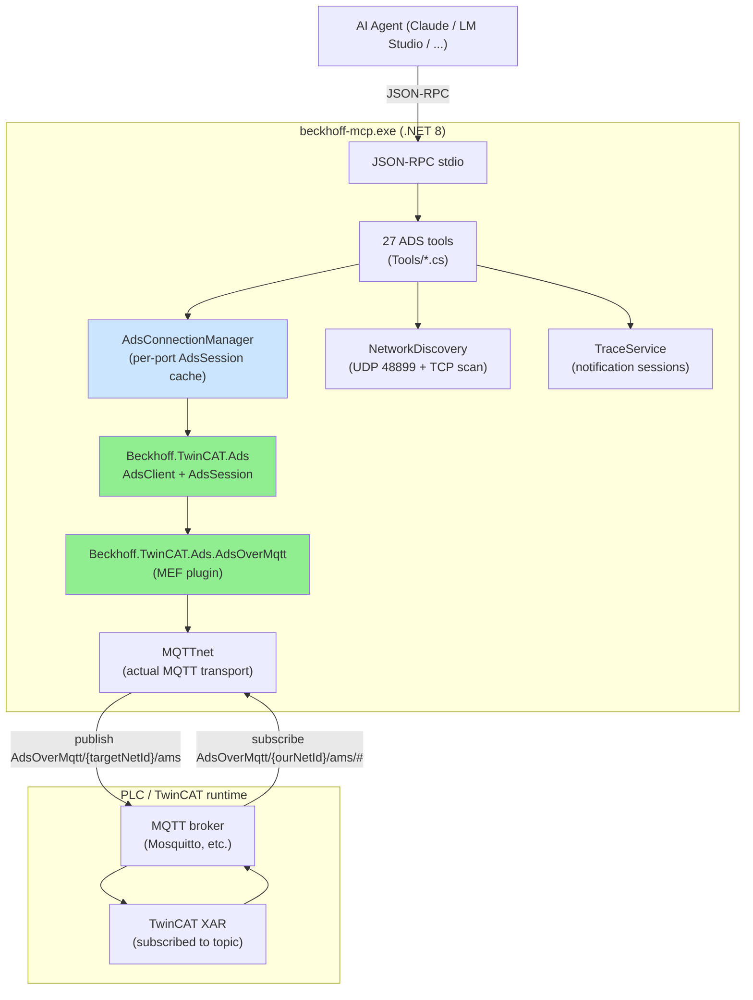
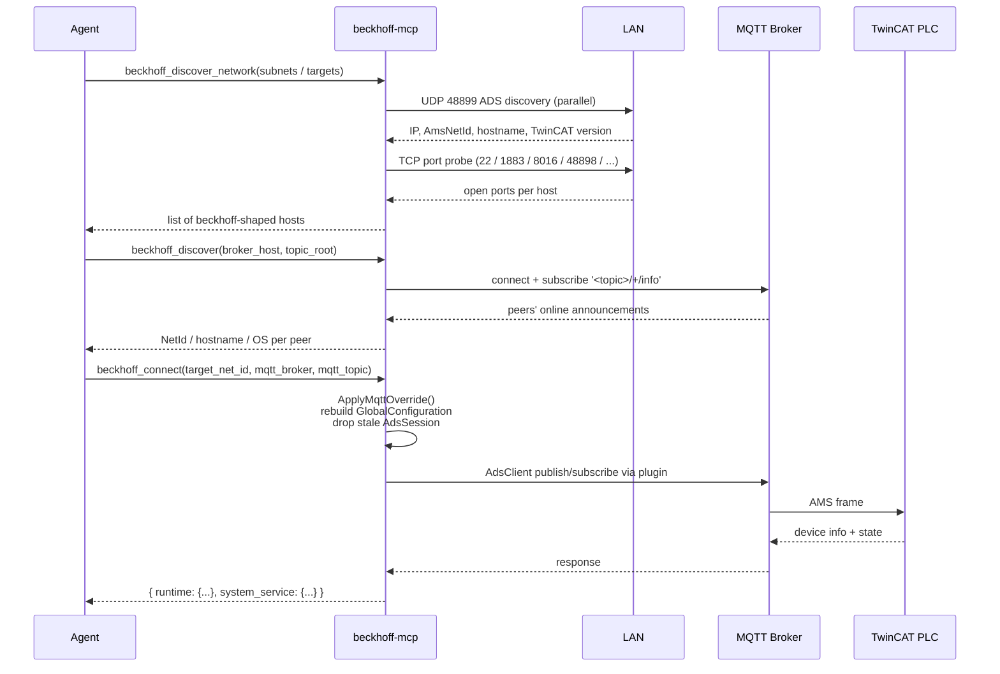
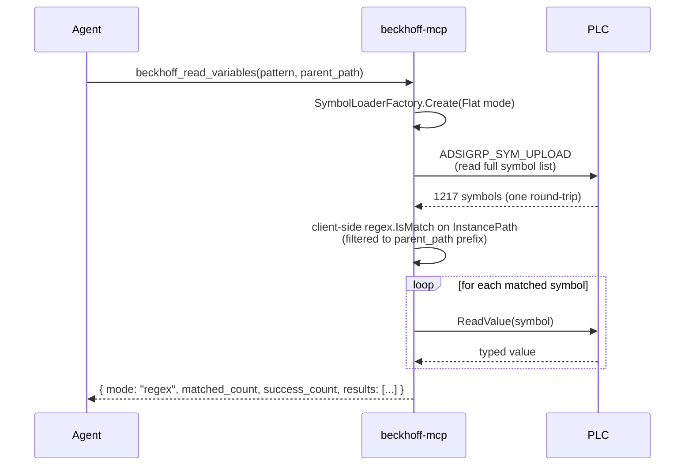

# Architecture

## Project layout

```
twincat-ads-mcp/
└── src/
    └── BeckhoffMcp.Server/         .NET 8 MCP server (the product)
        ├── Program.cs
        ├── appsettings.json
        ├── Services/
        │   ├── AdsConnectionManager.cs   AdsSession lifecycle + MQTT-override
        │   ├── LocalRouterDetector.cs    Detects an already-installed TwinCAT router
        │   ├── NetworkDiscovery.cs       UDP 48899 + TCP port scanner
        │   ├── RouteRegistration.cs      UDP/48899 AddRoute wire protocol
        │   ├── TraceService.cs          ADS-notification subscription pool
        │   └── WindowsCredentialPrompt.cs  CredUI dialog + Credential Manager (Windows only)
        └── Tools/
            ├── DeviceTools.cs            Device info/state (with port-override)
            ├── DiscoveryTools.cs         discover (MQTT) + discover_network + connect
            ├── EthercatTools.cs          EtherCAT master diagnostics
            ├── PortTools.cs              query_ads_port / read_from_port
            ├── RouteTools.cs             add_route (backroute registration)
            ├── RpcTools.cs               get_rpc_methods / invoke_rpc
            ├── SymbolTools.cs            list/read symbols (regex)
            ├── TraceTools.cs             trace_start / get / stop
            ├── TypeTools.cs              get_type_info / dereference
            └── WriteTools.cs             write_variable(s) / write_control
```

## Final stack



Green: the supported Beckhoff path that proves the whole system works without a
local TwinCAT install. Blue: our connection bookkeeping that makes broker /
target switching possible at runtime.

## Discovery and connect at runtime



`connect` always probes both the requested target port AND `SystemService` (10000),
so the agent gets a full picture of device-level vs application-level state in one
round-trip.

## Variable read with regex



ADS does **not** offer server-side regex symbol filtering — the entire symbol
table is uploaded once, then filtered locally. The sister-project `tcCLI`
implements this identically. We share the same `SymbolIterator` predicate
pattern from the official Beckhoff library.

## Why this architecture

The repo went through several iterations before landing here. Each stop
along the way (paths below refer to code that has since been removed from
this repo — see git history) is summarized in the table:

| Experiment | What it tried | Why it didn't ship |
|-----------|---------------|--------------------|
| `archive/python-mcp/` | Original pyads-based MCP | Needs `TcAdsDll.dll` + Win32 Window Message IPC to a local TwinCAT System Service. Won't run on a host without TwinCAT installed. |
| `archive/experiments/AdsRouter/` | Standalone .NET TCP-router (Beckhoff.TwinCAT.Ads.TcpRouter) | Connects to a broker and serves TCP-loopback for local clients, but doesn't forward arbitrary NetIds via MQTT. The MEF MQTT-plugin works at the local *Server* endpoint, not as a forwarding adapter. |
| `archive/experiments/AdsBridge/` | Custom TCP↔MQTT bridge in C# | Working proof — implements the AMS frame parser, routes by `<Type>` in StaticRoutes.xml. But Windows `pyads` still can't reach it (TcAdsDll bypasses TCP entirely), so the bridge only helps if you also rewrite the client. |
| `archive/experiments/AdsTestClient/` | Direct .NET AdsClient + AdsOverMqtt plugin | **Worked perfectly.** This is what the final MCP server uses internally — the plugin handles publish/subscribe on the broker, no router needed. The bridge became unnecessary. |

The key insight: **once the client code is .NET, the AdsOverMqtt plugin is the
shortest path** — it's the only Beckhoff-supported way of running an
ADS-over-MQTT-only stack without any local Beckhoff service. Rewriting the MCP
in C# (which we did) removed the need for everything in the table above.

## What couldn't be ported from the sister project

The sister project `Avm.Swiss.TwinCAT.CLI` has many tools that depend on
TwinCAT XAE (the engineering shell) via COM automation: `BuildTools`,
`ProjectTools`, `PouTools`, `LibraryTools`, `RuntimeTools`, `SafetyTools`,
`DialogTools`, `OutputPaneTools`, `SaveTools`, `TaskTools`, `TargetPlatformTools`,
`SessionTools`, `RouteTools` (the sister project's XAE-dialog-based route
manager — not the same class as this repo's own `RouteTools.cs`, which
registers routes over the ADS UDP/48899 wire protocol without any XAE/COM
dependency, see [`beckhoff_add_route`](tools-reference.md#beckhoff_add_route--registering-a-backroute-windows-only)),
`ComExplorerTools`. These are excluded by design — they would re-introduce
the XAE dependency we built this server to avoid.

What did get ported: every tool that talks to a running PLC over ADS
(read, write, RPC, type introspection, trace, EtherCAT diagnostics, route
registration, connect with broker switch).

## Related

- [Configuration](configuration.md) — config layering and the three
  connection transports in operational detail.
- [Tools reference](tools-reference.md) — the full tool list.
